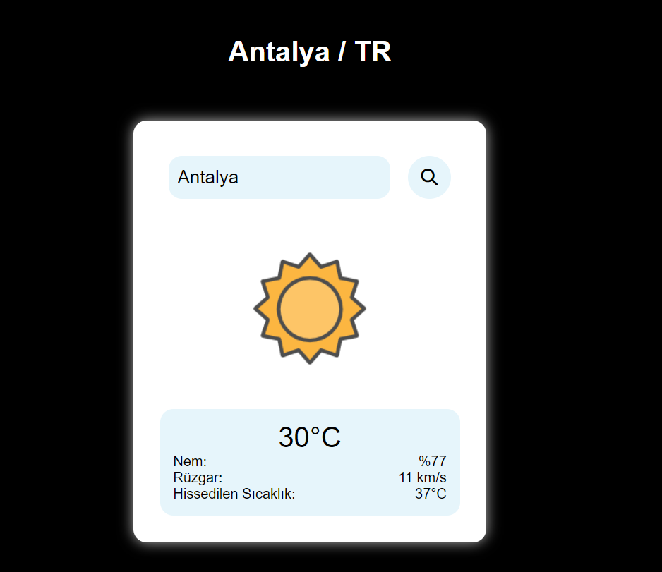

# Weather Application

## Genel Bakış

My weather forecast application, built using basic web technologies and supported by the Open Weather API, allows users to enter a city name and retrieve current weather information (temperature, humidity, wind speed, and feels-like temperature).

## Özellikler

- **City-Based Weather Search:** Users can enter a city name to receive current weather conditions.
- **Dynamic Weather Icons:** The application displays different icons based on current weather conditions (clear, cloudy, rainy, foggy, or snowy).
- **Responsive Design:** The application adapts to various screen sizes, making it usable on both desktop and mobile devices.

## Demo



## Installation

1. Clone the repository:

   ```bash
   git clone https://github.com/kullanici-adi/weather-forecast-app.git
   cd weather-forecast-app
   ```

2. Create an `env.json` file in the root directory and add your OpenWeatherMap API key:

   ```json
   {
     "API_KEY": "your_openweathermap_api_key"
   }
   ```

3. Open the `index.html` file in your browser to view the application.

## Usage

1. Open the application.
2. Enter the city name in the input box.
3. Click the search button or press Enter to retrieve the weather information.

## Code Structure

### HTML

The HTML file (`index.html`) contains the structure of the application, including the input field for the city name and placeholders for displaying weather information.

### CSS

The CSS file (style.css) provides the styling for the application, ensuring a responsive and visually appealing layout.

### JavaScript

The JavaScript file (script.js) contains the logic for fetching weather data from the OpenWeatherMap API and updating the user interface based on the retrieved data.

### env.json

The `env.json` file should contain your OpenWeatherMap API key. This file is used to securely store and access the API key within the application.

## Contributing

If you would like to contribute to this project, please fork the repository and use a feature branch. Pull requests are welcome.

---
